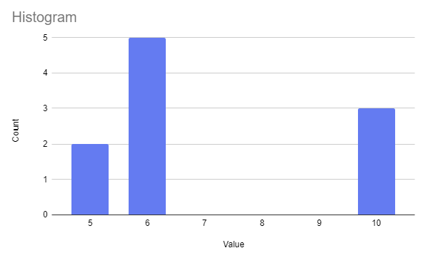
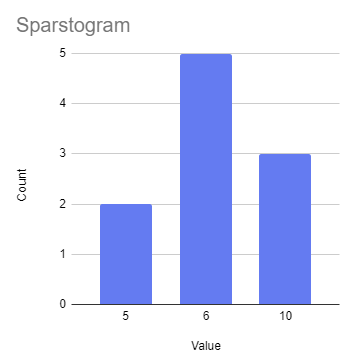
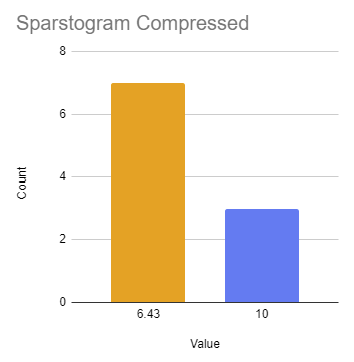

# Sparstogram Library

Sparse, adaptive, scalable histogram in TypeScript.  [On GitHub](https://github.com/Digithought/Sparstogram).

This Typescript library provides a sophisticated data structure for efficiently characterizing datasets through histograms.

## Summary

Sparstogram is a histogram that maintains a complete or sparse approximation of the data frequency.  The representation will be complete if the number of distinct values is less than or equal to the `maxCentroids`.  Otherwise, the values will be compressed to a smaller number of centroids in a way that minimizes the loss.  The histogram can also maintain a set of quantiles, which are maintained with each new value (e.g. median can be efficiently maintained).  The structure is adaptive in range and resolution, and can be used for streaming or large data digests.

The implementation uses B+Trees to efficiently maintain the centroids and losses, which is a self-balancing structure; so this should be able to scale efficiently.  As the number of unique data values grows beyond the configured `maxCentroids`, the loss returned from the `add` method will begin to be non-zero and represents how well the data in question compresses.  If and when this loss grows over some threshold, the user can choose to increase the `maxCentroids` value to maintain higher accuracy.  On the other hand, `maxCentroids` can by dynamically shrunk to reduce memory, at the expense of more approximation.

### Features:
* **Lossy or lossless** - depending on configured `maxCentroids`
* **Adaptive** - works on any numerical scale, rescales dynamically
* **Resizable** - `maxCentroids` can be dynamically adjusted up or down
* **Reports loss** continually as items are added; allowing dynamic growth to reduce loss
* **Quantile markers** - maintain relative rank points without re-scanning
  * Allows efficient maintenance of median, 95th percentile, etc. without traversal
* **Helper functions** - computed operations for finding rank by value, count by value, value by rank, value by quantile
* **Rank interpolation** - interpolates the rank between and beyond each centroid using variances in a normal distribution
* **Detailed quantile information** - includes: centroid, variance, count, rank, and offset within bucket
* **Histogram merging** - including maintaining variances
* **Peaks** - computes local maxima with average window smoothing, for use in frequency detection or clustering
* **Directional iteration** of centroid buckets from the ends, a marker, a value, or by loss
* **Compact** - only allocates memory for actual distinct values
* **Scalable** - uses in-memory B+Trees ([Digitree](https://github.com/Digithought/Digitree)) which are fast and balanced

### Why software developers should use histograms more

Histograms are often used in visualizing the frequency of occurrences, but many programmers don't know how useful histograms are as an analytical data structure.  Histograms are a powerful statistical tool that offer a frequency representation of the distribution of a dataset, which is useful across a variety of disciplines. There are many practical reasons for perceiving the distribution, outliers, skewness, range, magnitude, and central tendency of data. Just about any circumstance where there is signal with noise, histograms are invaluable for deciphering each, by establishing a cut-off quantile, or computing k-Means.

In image processing, histograms are crucial for scaling pixel values. By examining the histogram of an image's pixel intensities, you can accurately adjust the contrast and brightness, enhancing the image quality by stretching or compressing the range of pixel values to utilize the full spectrum more effectively.

In performance optimization, system monitoring, and distributed systems, histograms play a vital role in determining timing thresholds. By generating a histogram of response times or execution times of a system, you can identify common performance bottlenecks and outliers. This enables you to set appropriate thresholds for alerts or to optimize system performance by focusing on the most impactful areas. For instance, understanding the distribution of database query times can help in optimizing indexes or rewriting queries to reduce the tail latencies that affect user experience.

## Background

Sparstogram is inspired by the paper "Approximate Frequency Counts over Data Streams" by Gurmeet Singh Manku and Rajeev Motwani. Though similar in spirit, this implementation is quite different:
* Utilizes B+Trees for maintaining centroids and their associated losses, facilitating efficient scaling and automatic balancing.
* The variance within each centroid is also maintained to facilitate more accurate loss estimates
* Persisting the centroids ordered by their losses allows merging of centroids without scanning
* Persisted markers allows for determination of quantiles without scanning

### Traditional histogram

In a typical representation of a histogram, values are evenly spaced.  Really, each value represents a range of values that are grouped.  For instance, if the values are 4ms, 5ms, and 6ms; in reality each bucket represents an interval (3.4ms-4.5ms, 4.5ms-5.5ms, ...).

In computers, histograms are typically represented with an array, where every element represents the count in that range (or "entry").  There are a few noteworthy suppositions:
* The range is explicitly defined beforehand
* The resolution (breadth of each entry) is also explicitly defined beforehand
* All entries are stored, regardless of whether they are used (non-zero)



### Sparstogram

In a Sparstogram, no entries are stored until they are added, and no range is maintained between entries (AKA centroids) holding unused space.  The same histogram information as above is represented in a Sparstogram as only the three ordered entries having counts:



Unlike the traditional representation, the Sparstogram dynamically adapts itself in entries, resolution and range.  A limit can be imposed on a Sparstogram through `maxCentroids`.  Once that number of unique values has been reached, additional entries will results in compression so as not to exceed that many entries.  Compression involves merging two adjacent entries into one, with a new mean, combined count, and a computed variance.  The pair to merge are chosen based on least loss, which information is maintained in an internal index so as not to require searching for.  Here is an illustration of the same Sparstogram, were we to set `maxCentroids` to 2, thus asking it to shrink to only 2 entries:



Note that no mean information is lost in the compression, only distribution information.  To reduce the amount of distribution information lost, a variance is computed to capture the notion that the entry has "spread" and is no longer a point.  The `countAt`, `meanAt`, and the other accessor methods will attempt to interpolate based on that variance, based on a normal distribution.  As a result, though the true distribution is lost in the compression, the general effect of there being multiple entries is preserved.

### What do I do with this?

Create an instance with a `maxCentroids` budget, and feed is some information.  Time spent per User Interface, financial data, pixel brightnesses, audio samples, whatever.  The result will the the frequency of each value, which you can use to make judgements from.  You can maintain the median over a streaming dataset, for instance, or compute the 75th percentile of something to discover outliers or eliminate noise.


## Installation

To install the Sparstogram library, use the following command:

```bash
npm install sparstogram
```

Or, if you prefer using `pnpm`:

```bash
pnpm add sparstogram
```

## Usage

#### [Reference Documentation](https://digithought.github.io/Sparstogram/)

### Creating a Sparstogram

```ts
import { Sparstogram } from "sparstogram";

// Initialize a Sparstogram with a maximum of 100 centroids and a quantile marker for maintaining the median
const histogram = new Sparstogram(100, [0.5]);
```

### Adding Values to the Histogram

```ts
// Add a series of values to the histogram
histogram.add(5.0);
histogram.add(2.5);
const loss = histogram.add(3.7);

// Dynamically adjust maxCentroids based on the application's precision requirements
if (loss > 3.5) {
  histogram.maxCentroids = 150;
}
```

### Retrieving Data from the Histogram

```ts
// Retrieve the median value
const median = histogram.atQuantile(0.5).centroid.value;

// Or the same using the marker
const fastMedian = histogram.atMarker(0).centroid.value;

// Get the total count of values in the histogram
const totalCount = histogram.count;

// Find the rank of a specific value
const rank = histogram.atValue(3.7);

// Find the value at the given rank
const value = histogram.atRank(2);

// Iterate all centroids
for (const entry of histogram.ascending()) {
  console.log(entry);
}

// Iterate from the median backwards
for (const entry of histogram.descending({ markerIndex: 0 })) {
  console.log(entry);
}

// Iterate from a value forwards
for (const entry of histogram.ascending({ value: 2.5 })) {
  console.log(entry);
}
```

### Analyzing Histogram Peaks

```ts
// Find the local maxima with 5 item window smoothing for a simple analysis of the data distribution
const peaks = histogram.getPeaks(3);
```

## Contributing

Contributions to the Digitree Sparstogram library are welcome! Here's how you can contribute:

- **Reporting Bugs:** Open an issue describing the bug and how to reproduce it.
- **Suggesting Enhancements:** For new features or improvements, open an issue with a clear title and description.
- **Pull Requests:** For direct contributions, please make your changes in a separate fork and submit a pull request with a clear list of what you've done.

### TODO:
* kMeans computation - maybe even an option to maintain?  (See https://github.com/Digithought/Histogram for a C# implementation)
* Allan Variance option - for sequence sensitive applications, AVAR will give superior results.
* Maybe enable normal distribution based offset estimation?  ...Still trying to decide if this is useful.

### Environment

* If using VSCode use the editorconfig plugin to honor the conventions in `.editorconfig`
* Build: `pnpm build` or `npm run build`
* Test: `pnpm test` or `npm test`

## License

This project is licensed under the MIT License - see the LICENSE file for details.
