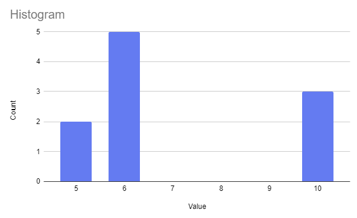
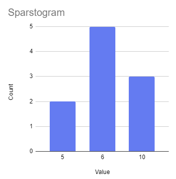
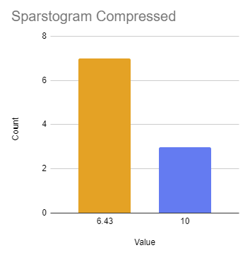

# Sparstogram Library

Sparse, adaptive, scalable histogram in TypeScript.  [On GitHub](https://github.com/Digithought/Sparstogram).

This Typescript library provides a sophisticated data structure for efficiently characterizing datasets through histograms.

## Summary

Sparstogram is a histogram that maintains a complete or sparse approximation of the data frequency.  The representation will be complete if the number of distinct values is less than or equal to the `maxCentroids`.  Otherwise, the values will be compressed to a smaller number of centroids in a way that intelligently minimizes loss while preserving distribution features like peaks and tails.  The histogram can also maintain a set of quantiles, which are maintained with each new value (e.g. median can be efficiently maintained).  The structure is adaptive in range and resolution, and can be used for streaming or large data digests.


The implementation uses B+Trees to efficiently maintain the centroids and their priority scores, which is a self-balancing structure that scales efficiently.  As the number of unique data values grows beyond the configured `maxCentroids`, the loss returned from the `add` method will begin to be non-zero and represents how well the data compresses.  If and when this loss grows over some threshold, the user can choose to increase the `maxCentroids` value to maintain higher accuracy.  On the other hand, `maxCentroids` can be dynamically shrunk to reduce memory, at the expense of more approximation.

The compression algorithm uses a **curvature-aware scoring system** that preferentially preserves regions where the empirical cumulative distribution function (CDF) bends sharply—such as peaks, valleys, and distribution tails—rather than simply merging the closest pairs. This approach is inspired by optimal k-point discrete approximations and Wasserstein-1 (Earth Mover's Distance) minimizing quantizers.

### Features:
* **Lossy or lossless** - depending on configured `maxCentroids`
* **Curvature-aware compression** - intelligently preserves peaks, valleys, and tails in the distribution
* **Adaptive** - works on any numerical scale, rescales dynamically
* **Resizable** - `maxCentroids` can be dynamically adjusted up or down
* **Reports loss** continually as items are added; allowing dynamic growth to reduce loss
* **Tightness metric** - provides a Wasserstein-1 proxy for monitoring compression quality
* **Quantile markers** - maintain relative rank points without re-scanning
  * Allows efficient maintenance of median, 95th percentile, etc. without traversal
* **Helper functions** - computed operations for finding rank by value, count by value, value by rank, value by quantile
* **Rank interpolation** - interpolates the rank between and beyond each centroid using variances in a normal distribution
* **Detailed quantile information** - includes: centroid, variance, count, rank, and offset within bucket
* **Histogram merging** - including maintaining variances, with batch compression optimization
* **Peaks** - computes local maxima with average window smoothing, for use in frequency detection or clustering
* **Directional iteration** of centroid buckets from the ends, a marker, a value, or by loss
* **Compact** - only allocates memory for actual distinct values
* **Scalable** - uses in-memory B+Trees ([Digitree](https://github.com/Digithought/Digitree)) which are fast and balanced

### Why software developers should use histograms more

Histograms are often used in visualizing the frequency of occurrences, but many programmers don't know how useful histograms are as an analytical data structure.  Histograms are a powerful statistical tool that offer a frequency representation of the distribution of a dataset, which is useful across a variety of disciplines. There are many practical reasons for perceiving the distribution, outliers, skewness, range, magnitude, and central tendency of data. Just about any circumstance where there is signal with noise, histograms are invaluable for deciphering each, by establishing a cut-off quantile, or computing k-Means.

In image processing, histograms are crucial for scaling pixel values. By examining the histogram of an image's pixel intensities, you can accurately adjust the contrast and brightness, enhancing the image quality by stretching or compressing the range of pixel values to utilize the full spectrum more effectively.

In performance optimization, system monitoring, and distributed systems, histograms play a vital role in determining timing thresholds. By generating a histogram of response times or execution times of a system, you can identify common performance bottlenecks and outliers. This enables you to set appropriate thresholds for alerts or to optimize system performance by focusing on the most impactful areas. For instance, understanding the distribution of database query times can help in optimizing indexes or rewriting queries to reduce the tail latencies that affect user experience.

## Background and Theory

Sparstogram is inspired by the paper "Approximate Frequency Counts over Data Streams" by Gurmeet Singh Manku and Rajeev Motwani. Though similar in spirit, this implementation incorporates several sophisticated enhancements:

* **B+Tree data structures** for maintaining centroids and their priority scores, facilitating efficient scaling and automatic balancing
* **Variance tracking** within each centroid to facilitate more accurate interpolation and loss estimates
* **Dual indexing** - centroids ordered by value and by compression priority score, enabling O(1) access to the best merge candidate
* **Curvature-aware scoring** that preserves distribution features by considering local CDF geometry
* **Tightness metric** for monitoring approximation quality in terms of Wasserstein-1 distance
* **Persisted quantile markers** allowing determination of specific percentiles without scanning

### Core Data Structure

The Sparstogram maintains centroids in two B+Tree indices:

1. **Value-ordered tree (`_centroids`)**: Maintains centroids sorted by their value, enabling efficient range queries, quantile lookups, and neighbor access
2. **Priority queue (`_losses`)**: Maintains centroid pairs sorted by their compression score, allowing O(1) identification of the best pair to merge

Each centroid stores:
- **value**: The mean value of all data points merged into this centroid
- **count**: The number of data points represented
- **variance**: The spread of values within the centroid (0 for uncompressed points)
- **loss**: The base pair loss to the prior centroid in value order

### Compression Algorithm Theory

When the number of centroids exceeds `maxCentroids`, the algorithm must merge adjacent pairs to reduce memory usage. The challenge is choosing *which* pairs to merge to minimize information loss while preserving important distribution features.

#### Curvature-Aware Scoring

Rather than simply merging the closest pairs (which would smooth out peaks and tails), Sparstogram uses a **curvature-aware scoring system** inspired by optimal transport theory and data-aware discretization methods.

The key insight is that the empirical CDF should be approximated more finely where it "bends" sharply (high curvature) and can tolerate coarser approximation in flat regions (low curvature). This is analogous to:
- **DAUD (Data-Aware Uniform Discretization)**: k-point approximations that minimize KL divergence or Wasserstein distance
- **Adaptive quantization**: Used in signal processing and image compression to allocate bits where they matter most
- **Divide-and-conquer quantization**: Merge-stable approaches with W1 error guarantees

#### Local Curvature Estimation

For each adjacent pair of centroids `(a, b)`, we estimate local CDF curvature by examining density changes with their neighbors:

```
density(u, v) = (count_u + count_v) / |value_v - value_u|
left_curvature = |density(l, a) - density(a, b)|  // where l is left neighbor
right_curvature = |density(a, b) - density(b, r)|  // where r is right neighbor
curvature = 0.5 * (left_curvature + right_curvature)
```

This approximates the second derivative of the empirical CDF at the seam between `a` and `b`.

#### Compression Score

The score used to prioritize merge candidates is:

```
score = baseLoss * (ε + curvature)
```

Where:
- **baseLoss** = weighted distance between centroids plus combined variance
- **ε** = small constant (1e-9) to prevent the score from being exactly zero
- **curvature** = local CDF curvature estimate

**Lower scores** (flat regions with low curvature) are merged first. **Higher scores** (high-curvature regions like peaks and tails) are preserved longer.

This means:
- Pairs in flat distribution regions (low curvature) get merged early
- Pairs at peaks, valleys, and tails (high curvature) are preserved
- The algorithm naturally adapts to the distribution shape

#### Base Loss Computation

The base loss between two centroids combines geometric and statistical information:

```
baseLoss = (count_a + count_b) * |value_a - value_b| + combinedVariance(a, b)
```

The **weighted distance** term captures the "transport cost" of moving mass, while the **combined variance** term accounts for information loss from merging distributions. The variance calculation properly handles the degrees of freedom and between-group variance:

```
combinedVariance = (SS_a + SS_b + SS_between) / (n_total - 1)
```

Where `SS_between` captures the variance introduced by the difference in means.

#### Weighted Median Recentering

When merging two centroids, the new centroid is placed at the **weighted median** (the value of whichever centroid has more mass) rather than the weighted mean. This "micro-recentering" better preserves the distribution structure, especially for skewed or multi-modal data within the pair.

### Tightness Metric

The `tightnessJ` property provides a cheap, incrementally-maintained proxy for Wasserstein-1 (Earth Mover's) distance:

```
tightnessJ = Σ min(count_i, count_{i+1}) × |value_{i+1} - value_i|
```

This metric:
- **Correlates with W1 drift**: Approximates the transport cost of the discretized distribution
- **Units**: count × value-units (e.g., if counting milliseconds, units are count·ms)
- **Interpretation**: Lower = tighter/less spread; higher = looser/more separation
- **Maintained incrementally**: Updated locally during insertions and compressions without full recalculation
- **Use case**: Monitoring relative compression quality within the same dataset/scale

Note that `tightnessJ` is a heuristic approximation, not an exact W1 distance. It's unnormalized and scale-dependent, making it best suited for relative monitoring (e.g., tracking how compression affects distribution spread) rather than as an absolute error bound.

### Traditional histogram

In a typical representation of a histogram, values are evenly spaced.  Really, each value represents a range of values that are grouped.  For instance, if the values are 4ms, 5ms, and 6ms; in reality each bucket represents an interval (3.4ms-4.5ms, 4.5ms-5.5ms, ...).

In computers, histograms are typically represented with an array, where every element represents the count in that range (or "entry").  There are a few noteworthy suppositions:
* The range is explicitly defined beforehand
* The resolution (breadth of each entry) is also explicitly defined beforehand
* All entries are stored, regardless of whether they are used (non-zero)



### Sparstogram Representation

In a Sparstogram, no entries are stored until they are added, and no range is maintained between entries (AKA centroids) holding unused space.  The same histogram information as above is represented in a Sparstogram as only the three ordered entries having counts:



Unlike the traditional representation, the Sparstogram dynamically adapts itself in entries, resolution and range.  A limit can be imposed on a Sparstogram through `maxCentroids`.  Once that number of unique values has been reached, additional entries will result in compression so as not to exceed that many entries.  

Compression involves merging two adjacent entries into one, with a new value (at the weighted median), combined count, and a computed variance.  The pair to merge is chosen based on the lowest curvature-aware score, prioritizing merges in flat regions while preserving peaks, valleys, and tails.  This information is maintained in an internal priority queue so as not to require searching.  

Here is an illustration of the same Sparstogram, were we to set `maxCentroids` to 2, thus asking it to shrink to only 2 entries:



Note that the weighted mean information is preserved through the count-weighted centroid values, while distribution shape information is captured through variance.  To reduce the amount of distribution information lost, a variance is computed to capture the notion that the entry has "spread" and is no longer a point.  The `countAt`, `rankAt`, and other accessor methods will interpolate based on that variance, assuming a normal distribution.  As a result, though the true distribution is lost in the compression, the general effect of there being multiple entries is preserved, and important distribution features (like modes) are preferentially retained by the curvature-aware compression algorithm.

### What do I do with this?

Create an instance with a `maxCentroids` budget, and feed is some information.  Time spent per User Interface, financial data, pixel brightnesses, audio samples, whatever.  The result will the the frequency of each value, which you can use to make judgements from.  You can maintain the median over a streaming dataset, for instance, or compute the 75th percentile of something to discover outliers or eliminate noise.


## Installation

To install the Sparstogram library, use the following command:

```bash
npm install sparstogram
```

Or, if you prefer using `pnpm`:

```bash
pnpm add sparstogram
```

## Usage

#### [Reference Documentation](https://digithought.github.io/Sparstogram/)

### Creating a Sparstogram

```ts
import { Sparstogram } from "sparstogram";

// Initialize a Sparstogram with a maximum of 100 centroids and a quantile marker for maintaining the median
const histogram = new Sparstogram(100, [0.5]);
```

### Adding Values to the Histogram

```ts
// Add a series of values to the histogram
histogram.add(5.0);
histogram.add(2.5);
const loss = histogram.add(3.7);

// Dynamically adjust maxCentroids based on the application's precision requirements
if (loss > 3.5) {
  histogram.maxCentroids = 150;
}
```

### Retrieving Data from the Histogram

```ts
// Retrieve the median value
const median = histogram.quantileAt(0.5).value;

// Or the same using the marker (faster, maintained incrementally)
const fastMedian = histogram.markerAt(0).value;

// Get the total count of values in the histogram
const totalCount = histogram.count;

// Get the tightness metric (Wasserstein-1 proxy)
const tightness = histogram.tightnessJ;

// Find the rank of a specific value
const rank = histogram.rankAt(3.7);

// Find the value at the given rank
const quantile = histogram.valueAt(2);
const value = quantile.value;

// Get interpolated count at a specific value
const count = histogram.countAt(3.7);

// Iterate all centroids
for (const entry of histogram.ascending()) {
  console.log(entry);
}

// Iterate from the median backwards
for (const entry of histogram.descending({ markerIndex: 0 })) {
  console.log(entry);
}

// Iterate from a value forwards
for (const entry of histogram.ascending({ value: 2.5 })) {
  console.log(entry);
}
```

### Analyzing Histogram Peaks

```ts
// Find the local maxima with smoothing window for distribution analysis and clustering
for (const peak of histogram.peaks(3)) {
  console.log(`Peak from ${peak.start} to ${peak.end}, max count: ${peak.max}`);
}
```

### Merging Histograms

```ts
// Merge another histogram into this one
const histogram1 = new Sparstogram(100);
const histogram2 = new Sparstogram(100);

// Add data to both
histogram1.add(1.0);
histogram1.add(2.0);
histogram2.add(3.0);
histogram2.add(4.0);

// Merge histogram2 into histogram1
histogram1.mergeFrom(histogram2);

// Now histogram1 contains all data from both
console.log(histogram1.count); // 4
```

### Batch Operations

```ts
// Add multiple centroids at once (more efficient for bulk operations)
const centroids = [
  { value: 1.0, count: 10, variance: 0.5 },
  { value: 2.0, count: 20, variance: 0.3 },
  { value: 3.0, count: 15, variance: 0.4 }
];

const maxLoss = histogram.append(...centroids);
console.log(`Max loss from batch: ${maxLoss}`);
```

## Research and Advanced Topics

### Relationship to Optimal Transport

The curvature-aware compression in Sparstogram is inspired by optimal transport theory, particularly Wasserstein-1 (Earth Mover's Distance) minimization. The W1 distance between two probability distributions can be thought of as the minimum "cost" of transforming one distribution into another, where cost is the amount of mass moved times the distance moved.

When compressing a histogram, we're essentially solving a discrete optimal transport problem: how to reduce k centroids to (k-1) centroids while minimizing the W1 distance to the original distribution. The curvature-aware approach approximates this by:

1. **Computing base loss** as a local transport cost (weighted distance + variance)
2. **Adjusting by curvature** to account for global distribution shape
3. **Preferring merges** where the CDF is approximately linear (low curvature)

This is related to several research areas:

#### K-Point Discrete Approximations

The problem of approximating a continuous or high-resolution discrete distribution with k points has been studied extensively:

- **Quantile approximation**: Classic approach places points at fixed quantiles (e.g., median, quartiles)
- **Lloyd-Max quantization**: Iteratively optimizes point placement for minimum mean squared error
- **DAUD (Data-Aware Uniform Discretization)**: Places points to minimize KL divergence while maintaining some uniformity
- **Wasserstein barycenters**: Finds optimal k-point approximations under W1 or W2 distance

Sparstogram differs from these in that it operates incrementally (streaming) and adaptively adjusts its representation as data arrives, rather than requiring multiple passes over the data.

#### Adaptive Mesh Refinement

The curvature-aware approach is analogous to adaptive mesh refinement in numerical analysis and computational physics, where:

- Higher resolution (more points) is allocated to regions with rapid changes
- Lower resolution suffices for smooth regions
- Local error estimates drive refinement decisions

In Sparstogram, curvature serves as the "error estimate" that drives where to preserve detail.

#### Signal Processing and Rate-Distortion Theory

The compression algorithm relates to concepts from signal processing:

- **Adaptive quantization**: Allocating bits where they matter most based on signal characteristics
- **Perceptual coding**: Preserving features humans perceive (peaks, edges) while compressing smooth regions
- **Rate-distortion trade-off**: The `maxCentroids` parameter controls the "rate" (memory usage) and the curvature-aware scoring optimizes "distortion" (information loss)

The `tightnessJ` metric serves as a distortion measure, allowing users to monitor the rate-distortion trade-off.

### Streaming and Online Algorithms

Sparstogram is designed for streaming data scenarios where:

- Data arrives sequentially and cannot be stored in full
- The distribution may be non-stationary (changing over time)
- Memory is limited and must be bounded

This places Sparstogram in the family of **streaming algorithms** and **online algorithms**:

#### Space Complexity

- **Best case**: O(k) where k = number of distinct values (when k ≤ maxCentroids)
- **Worst case**: O(maxCentroids) regardless of input size
- **Practical**: B+Tree overhead adds log factors, but these are small constants

#### Time Complexity

- **add()**: O(log n) where n = current number of centroids
  - O(log n) to find position in value-ordered tree
  - O(1) to update if existing centroid
  - O(log n) to insert if new centroid
  - O(log n) to update priority queue
  - O(log n) to compress if over maxCentroids
- **quantileAt()**: O(log n) for value-ordered traversal
- **markerAt()**: O(1) for pre-maintained quantiles
- **mergeFrom()**: O(m log n) where m = centroids in other histogram

#### Comparison to Other Streaming Quantile Algorithms

| Algorithm | Space | Query Time | Update Time | Accuracy |
|-----------|-------|------------|-------------|----------|
| Sparstogram | O(k) | O(log k) | O(log k) | Curvature-adaptive |
| t-digest | O(k) | O(k) | O(log k) | Quantile-adaptive |
| Q-digest | O(log u) | O(log u) | O(log u) | Uniform error |
| GK (Greenwald-Khanna) | O(1/ε log εn) | O(log 1/ε) | O(log 1/ε) | ε-approximate |
| KLL sketch | O(1/ε log n) | O(1) | O(1) amortized | ε-approximate |

Where:
- k = number of centroids (user-controlled)
- u = universe size (range of possible values)
- ε = error parameter
- n = number of items seen

**Sparstogram's advantages**:
- User controls exact memory budget via `maxCentroids`
- Preserves peaks and multimodal structure (not just quantiles)
- Maintains full distribution approximation, not just quantiles
- Supports efficient merging for distributed/parallel scenarios
- Provides loss feedback for dynamic memory adjustment

**Trade-offs**:
- No formal ε-approximation guarantee (though tightnessJ provides heuristic)
- Query time is O(log k) vs O(1) for some sketches
- Better suited for understanding distribution shape than pure quantile estimation

### Variance Tracking and Interpolation

Each centroid maintains a variance, which serves multiple purposes:

#### Loss Computation

When merging centroids a and b, the variance contributes to the base loss:

```
SS_a = variance_a × (count_a - 1)  // sum of squares
SS_b = variance_b × (count_b - 1)
SS_between = (count_a × count_b × (value_a - value_b)²) / (count_a + count_b)
combined_variance = (SS_a + SS_b + SS_between) / (count_a + count_b - 1)
```

This properly accounts for:
- Within-group variance (SS_a, SS_b)
- Between-group variance (SS_between)
- Degrees of freedom

#### Rank and Count Interpolation

When querying a value that falls between centroids, or within a compressed centroid, Sparstogram assumes the mass follows a **normal distribution** with the centroid's mean and variance:

```
density(x) = (1 / (σ√(2π))) × exp(-0.5 × ((x - μ) / σ)²)
CDF(x) = 0.5 × (1 + erf((x - μ) / (σ√2)))
```

This allows:
- **Smooth interpolation** between and beyond centroids
- **Reasonable extrapolation** for values outside the observed range
- **Count estimation** at arbitrary values

The normal distribution assumption is a simplification, but works well in practice:
- For uncompressed centroids (variance = 0), it degenerates to a point mass
- For compressed centroids, it provides a unimodal, symmetric approximation
- The curvature-aware compression tries to keep similar-shaped regions together

#### Alternative Approaches

Other approaches to interpolation include:
- **Linear interpolation**: Simpler but less accurate, especially for counts
- **Piecewise constant**: Assumes uniform distribution within each centroid
- **Spline interpolation**: More flexible but requires more computation
- **Kernel density estimation**: More accurate but computationally expensive

The normal distribution strikes a balance between accuracy, computational efficiency, and theoretical justification (Central Limit Theorem suggests compressed centroids approximate normal distributions).

### Distributed and Parallel Scenarios

Sparstogram is well-suited for distributed and parallel computing:

#### Embarrassingly Parallel

Multiple Sparstogram instances can process different data partitions independently:

```ts
// On worker 1
const hist1 = new Sparstogram(1000);
for (const value of partition1) hist1.add(value);

// On worker 2
const hist2 = new Sparstogram(1000);
for (const value of partition2) hist2.add(value);

// On coordinator
const combined = new Sparstogram(2000);
combined.mergeFrom(hist1);
combined.mergeFrom(hist2);
```

#### Hierarchical Aggregation

For large-scale systems, use tree-based aggregation:

```
    Level 0: [H1] [H2] [H3] [H4] [H5] [H6] [H7] [H8]  (workers)
    Level 1:     [H12]     [H34]     [H56]     [H78]  (reducers)
    Level 2:          [H1234]             [H5678]     (reducers)
    Level 3:                 [H12345678]              (final)
```

Each merge operation is efficient and the variance tracking ensures accuracy is maintained.

#### Time-Window Aggregation

For streaming systems with time windows:

```ts
const windows = new Map<number, Sparstogram>();

function processValue(timestamp: number, value: number) {
  const windowId = Math.floor(timestamp / WINDOW_SIZE);
  if (!windows.has(windowId)) {
    windows.set(windowId, new Sparstogram(100));
  }
  windows.get(windowId)!.add(value);
}

// Merge windows for longer-term analysis
function getHourlyAggregate(hour: number) {
  const hourlyHist = new Sparstogram(500);
  for (let min = 0; min < 60; min++) {
    const windowId = hour * 60 + min;
    if (windows.has(windowId)) {
      hourlyHist.mergeFrom(windows.get(windowId)!);
    }
  }
  return hourlyHist;
}
```

### Limitations and Future Work

#### Current Limitations

1. **No formal error bounds**: Unlike GK or KLL, Sparstogram doesn't provide formal ε-approximation guarantees. The `tightnessJ` metric is heuristic.

2. **Normal distribution assumption**: Interpolation assumes normality, which may not hold for all data patterns.

3. **Local curvature only**: The curvature metric uses only immediate neighbors, which may miss global structure.

4. **Single dimension**: Currently handles univariate data only (though could be extended to multiple independent histograms).

5. **Iterator invalidation**: The `ascending()` and `descending()` generators yield lazily from internal B+Tree paths. Mutating the histogram during iteration (via `add()`, `append()`, `mergeFrom()`, or the `maxCentroids` setter) invalidates the iterator and may produce incorrect results or errors.

#### Potential Enhancements

1. **K-means integration**: Automatically detect and maintain cluster centers based on peak detection.

2. **Allan variance**: For time-series data, AVAR could provide better stability and noise characterization.

3. **Adaptive maxCentroids**: Automatically adjust based on `tightnessJ` to maintain quality targets.

4. **Formal error bounds**: Develop theoretical bounds on quantile approximation error as a function of `maxCentroids` and curvature.

5. **Non-parametric interpolation**: Alternative to normal distribution assumption, perhaps based on observed local shape.

6. **Multi-dimensional extension**: Joint histograms or copula-based approaches for multivariate data.

7. **Incremental computation**: Maintain running statistics (mean, std dev, skewness, kurtosis) incrementally.

## Contributing

Contributions to the Digitree Sparstogram library are welcome! Here's how you can contribute:

- **Reporting Bugs:** Open an issue describing the bug and how to reproduce it.
- **Suggesting Enhancements:** For new features or improvements, open an issue with a clear title and description.
- **Pull Requests:** For direct contributions, please make your changes in a separate fork and submit a pull request with a clear list of what you've done.

### TODO:
* kMeans computation - maybe even an option to maintain?  (See https://github.com/Digithought/Histogram for a C# implementation)
* Allan Variance option - for sequence sensitive applications, AVAR will give superior results.
* Maybe enable normal distribution based offset estimation?  ...Still trying to decide if this is useful.

### Environment

* If using VSCode use the editorconfig plugin to honor the conventions in `.editorconfig`
* Build: `yarn build` or `npm run build`
* Test: `yarn test` or `npm test`

## License

This project is licensed under the MIT License - see the LICENSE file for details.
